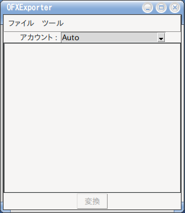

# OFXExporter
___
## 概要
OFXExporterは、csvファイルをOFXファイルに変換するプログラムです。  
※具体的には、MS-MONEYに取り込める形式のOFXファイルを生成する事を唯一の目的にしています。  

## 対応資産
OFXExporterは、以下の金融機関のcsvファイルをOFXファイルに変換します。
- 三菱UFJ銀行
- 三井住友銀行
- 住信SBIネット銀行
- じぶん銀行

- 三菱東京UFJ-VISA
- イオンカード
- au PAY カード
- au PAY プリペイドカード
- amazonマスターカード

- スマートレシート
- アマゾン注文履歴フィルタ(amzOrderHistoryFilter)
- 価格OFX

## 開発環境
OFXExporterは、python3.9の環境で開発されています。（バージョンに別段の意味は無いです）  
動作の確認は、以下の環境で実施しています。
- linux ubuntu 20.04 
- windows10 + Python 3.9.12 by www.python.org

## インストール
### pythonの実行環境を用意します
OFXExporterは、フルpythonで作成されています。  
まずは事前にそれぞれの環境に応じてpythonの環境を用意します。  

### 必要パッケージのインストール
OFXExporterは、以下のパッケージを使用しています。  
pipコマンド等を使用してインストールします  
``` 
% pip install chardet
% pip install tkinterdnd2
% pip install xmltodict
% pip install dicttoxml
% pip install configparser
% pip install requests
% pip install beautifulsoup4
% pip install yahoo_finance_api2
% pip install ofxtools
```
### 本体のインストールとディレクトリ構造
適当な場所にOFXExporterを展開します。  
```
% tree -L 1
.
├── LICENSE　　　　　
├── OFXExporter.py
├── OFXExporterGui.py
├── README.txt
├── account.json
├── config.ini
├── filters
├── misc
├── test_main.py
├── tests　　　　　　　
└── tools
　　　　├── DownloadStockPrice.py
　　　　├── GenPriceByDate.py
　　　　├── OFXGenerator.py
　　　　├── morningstar_map.txt
　　　　└── stockList.txt
```
|ファイル名|説明|
|---|---|
| OFXExporter.py | OFXExporterの本体 |
| OFXExporterGui.py | OFXExporter.pyで使用するGUIプログラム |
| account.json | アカウント情報ファイル |
| config.ini | コンフィグレーションファイル|
| filters | 各金融機関用の変換プログラムの格納ディレクトリ |
| morningstar_map.txt | モーニングスターのスクレーピング用の設定 |
| stockList.txt | 株価・基準価格取得用のファイル |

## 実行
OFXExporterのディレクトリのtopでコマンドラインから以下のコマンドを実行します。  

``` 
% python -m OFXExporter
　　　or
% python OFXExporter.py
```


GUIの画面が立ち上がります。



## 使い方
### 口座登録
- OFXExporterは最初に口座情報を設定する必要があります。
- 情報はjson形式でアカウント情報ファイルに格納されます。直接修正も可能です。
- GUIからの口座情報の管理は、**ファイル->アカウント管理**から実施します。

1. 口座の追加：
- 追加ボタンで金融機関と口座情報を結びつけることが出来ます。
- 使用する金融機関を選択して口座の情報を追加してください。
- 店番は必須ではありません。
- 口座番号は実在の値である必要はありませんが、MS-MONEYの口座番号と合わせる必要があります。

2. 口座の変更：
- account一覧の画面から口座を選択して変更ボタンを押すと変更画面が表示されます。

3. 口座の削除：
- account一覧の画面から口座を選択して削除ボタンを押すと口座情報を削除します

### OFXファイルへの変換
アカウント（口座情報）をプルダウンメニューから選択し、予め用意しておいたCSVファイルをOFXExporterにドロップします。  
選択されたモードに従い、csvファイルの解析を実施します。  
解析が正常終了した場合、変換ボタンがアクティブになり、ボタンを押すことによって変換が開始します。  
変換済みのファイルはインストールディレクトリに **[./output/アカウント名]** のOFXファイルとして出力されます。　　

1. autoを選択した場合：
- ドロップしたファイルを解析して変換可能の口座情報をリスト表示します。
- リストを選択した後に変換ボタンを押すと変換ボタンがアクティブになります。
- ドロップするファイルは１つしか使用できません

2. 価格OFXを選択した場合：
- 事前に入手した株価・基準価格ファイルをドロップします。
- ドロップするファイルは複数可能です。
- 全てのファイルの解析が成功した後に変換ボタンがアクティブになります。
- 詳しくは後述の***価格情報のダウンロード***の項を参照してください。

3. それ以外を選択した場合：
- 指定した口座の定義でCSVファイルを変換します。
- 複数のファイルを指定することはできますが、処理の実行は各金融機関処理の実装に依存します。
- 全てのファイルの解析が成功した後に変換ボタンがアクティブになります。

### 最新の価格情報の入手
- OFXExporterは、前日の株価、及び投資信託の基準価額を直接インターネットからダウンロードすることが出来ます。
- 価格更新には’ツール->価格更新’を実行します。
- downloadする情報は **[./tools/stockList.txt]** で指定することが出来ます。

## 価格情報のダウンロード
OFXExporterは、過去の株価データを、**制限付きですが**、ダウンロードする機能を持っています。  
以下のコマンドを実行することで、設定した期間の株価情報を入手しようと試みます。  
```
% python -m tools.DownloadStockPrice  
```
ダウンロードされたファイルは、prices配下にcsvファイル形式として生成されます。  
このファイルをOFXExporterの価格OFXを使ってOFX形式に変換します。  

### ダウンロードする情報の指定
ダウンロードする価格のリストは、 **[./tools/stockList.txt]** で指定します。  
フォーマットは以下のような証券番号と名称のペアーを羅列します。  

***'証券番号'-'名称'***

```
% cat tools/stockList.txt
7203-トヨタ自動車
9984-ソフトバンクグループ
1305-ダイワ上場投信
04315017-ダイワ上場投信−トピックス
```


### 株価：
現在はyahoo-finance-apiを使用して日足のデータとして読み込もうとします。  
ただし、yahoo-financeは無料の使用は正式にはアナウンスされていない機能の為に、読み込み機能は***yahoo-finance***の環境に依存します。  

### 投資信託：
現在は、モーニングスターのWEB画面をスクレーピングして入手しています。  
このためにこのコマンドでも入手可能な価格情報は最新のもの１つのみとなります。  
また、モーニングスターのURLは証券番号や協会番号とは異なる値を持っているので使用する場合は、変換ファイル（morningstar_map）を適切に指定する必要があります。  

***'証券番号', 'URLのアドレス', '名称'***

URLのアドレスは、モーニングスターで指定銘柄を検索時の***URLのfnc***の値を指定します。  
例えば、

ダイワ 上場投信-トピックスの場合：  
URL ：　https://portal.morningstarjp.com/FundData/SnapShot.do?fnc=2001071102　　

以下のようなデータを設定します。  

```
% cat tools/morningstar_map.txt
04315017,2001071102,ダイワ 上場投信-トピックス
```


もし、過去のデータのOFXファイルを作成したい場合には、モーニングスターの各商品のページにある***[チャート->基準価額をダウンロード]***のファイルをダウンロードしてOFXExporterに読み込ませることが出来ます。  
※モーニングスターはメンテナス中になっていることも多いのでうまく行かないときはブラウザで確認する事をおすすめします。  

### ファイル名の制限：
OFXExporterの価格OFXはファイル名から証券・協会番号を求めます。この為に入力ファイル名は以下のファイル名の規約に従う必要があります。  

***'証券番号'-'名称'.csv***

ファイルの内容は、**[日付,終値]** or **[日付,基準価額]**のcsv形式となります。  
具体的には、インストールディレクトリの**[./tests/sample/prices]**以下のファイルを参考にしてください。

### 制限事項：
MS-MONEYの仕様として一つの明細で更新できるのは一つの価格のようです。  
このために過去の複数の履歴を一つのOFXファイルに格納しても過去のデータは無効(上書き？）になります。  

## exe化
[tkinterdnd2](https://github.com/pmgagne/tkinterdnd2)からzipファイルを入手してインストールしたディレクトリに展開した後に以下のコマンドを実行します。  

``` 
% pyinstaller OFXExporter.py --onefile --noconsole --icon=misc/OFXExporter.ico --additional-hooks-dir=./tkinterdnd2-master
```

## Next
テストデータの入手と個人的な開発環境の問題で以下の機能は未完です。
※そのうち作りたいですね。 

- 証券会社の取引履歴CVSの取り込み  
- windows上でのOFXファイルの自動読み込み機能（mnyimport.exe：複数ファイル対応）  

___
2022/05/26 現在
